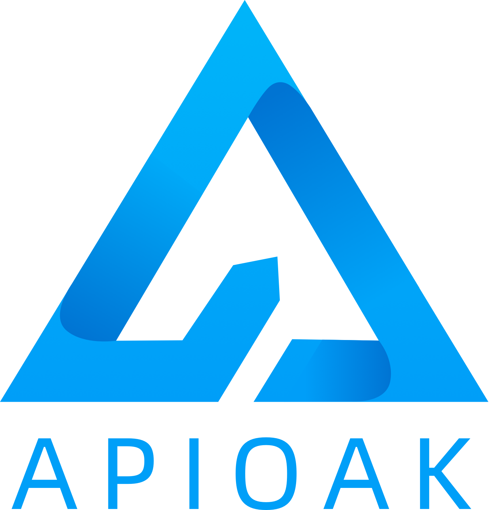

<p align="center">
  
</p>

<p align="center">
  <a href="https://github.com/apioak/apioak-admin">
    
  </a>
  <a href="https://github.com/golang/go">
    
  </a>
  <a href="https://github.com/gin-gonic/gin">
    
  </a>
</p>

[简体中文](README_CN.md) | [English](README.md)

## Introduction
`apioak-admin` is the control plane backend project of `apioak` gateway, based on <a target="_blank" href="https://github.com/golang/go">Go 1.16</a> and <a target="_blank" href="https://github.com/gin-gonic/gin">Gin 1.7.2</a> development, the project matches the data surface project <a target="_blank" href="https ://github.com/apioak/apioak">apioak</a>.
The project aims to simplify the use of `apioak`, optimize the user's operation, and achieve a minimal operation to complete the launch and release of a complete service configuration.

## Compile
```
go build -o apioak-admin main.go
```

## Rely
For the system dependencies necessary to install `apioak-admin` on different operating systems (`MySQL >= 5.7 or MariaDB >= 10.2`, etc.), please refer to: [Dependency Installation Documentation](doc/zh_CN/install-dependencies.md ).

## Configuration
- Import the database configuration file to `MySQL` or `MariaDB`, the data table configuration file path `/path/config/apioak.sql`.

- Create a `config` directory in the directory where the `apioak` executable file generated after the above compilation command is located, and copy the configuration file `app_example.yaml` under the `apioak-admin` project to this directory, and change the name to` app.yaml`, and then configure the database connection information of the `database` item in the configuration file, the `server` item accesses the service information after starting the service, and the `apioak` item is the `admin-api` deployed on the data plane of the data plane access information.

## Run
```
./apioak-admin
```

## Other
For the convenience of use in the project, there are executable files that already include the front-end and back-end projects of this project. You only need to download the corresponding executable files, and then add the `config/app.yaml` configuration file in the executable file directory to complete To start the front-end and back-end projects, directly access the `server` item in the `config/app.yaml` configuration file to operate.

